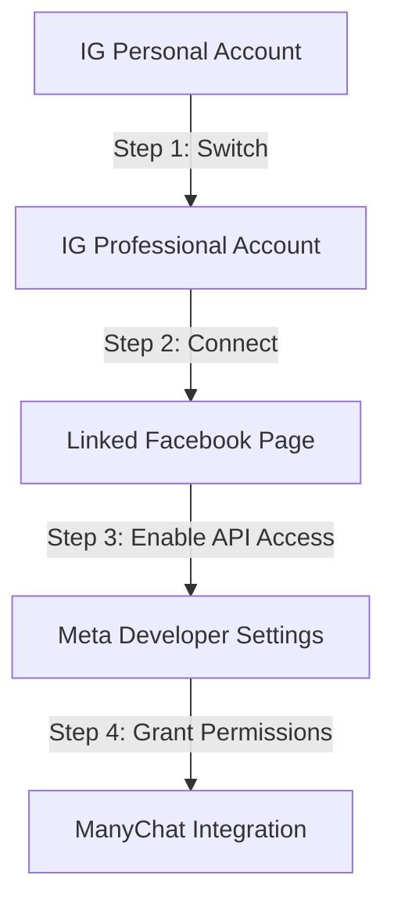
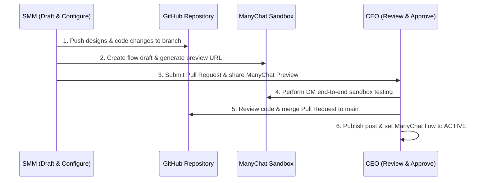

# 🗺️ Instagram Automation & Collaborative Control Roadmap
**Target Audience**: MetrixMedia Internal Leadership (CEO & SMM)  
**Objective**: Establish a secure, high-converting, automated lead acquisition funnel via Instagram DM triggers for the **Aegis Review Protocol**, governed by a robust SMM-to-CEO approval workflow.

---

## 📌 Executive Summary
To scale client acquisition for the **Aegis Protocol**, we are launching a conversational Instagram funnel. When local business prospects engage with our content (reels, posts, or stories) and DM specific keywords, ManyChat will instantly route them to our custom web generator (try.html) to set up their profile, generate a personalized live preview of their Aegis Review Portal, and sync their lead data to our database.

This roadmap details:
1. **Infrastructure**: Linking Instagram to Meta APIs and ManyChat.
2. **Technical Integration**: Linking the DM button to the `try.html` web form to generate live lead demos.
3. **Control Workflow**: The collaborative approval loop between the SMM and the CEO to ensure brand safety, design quality, and bug-free automation.

---

## 🛠️ Phase 1: Meta API & ManyChat Setup
To enable automated messaging, the `@MetrixMedia` Instagram account must be linked to Meta’s Business Manager and ManyChat. Follow these step-by-step instructions:

### Step 1: Instagram Account Optimization
1. Open the Instagram app on the agency phone, go to **Settings and Activity** -> **Account Type and Tools**.
2. Select **Switch to Professional Account** and choose **Business** (do not select *Creator*, as Business accounts have higher API rate limits).
3. Set the business category to **Digital Marketing Agency** and complete the profile details.

### Step 2: Link Facebook Page
1. Go to the Meta Business Manager Suite.
2. Under **Business Assets**, create or select the **MetrixMedia Facebook Page**.
3. Go to **Linked Accounts** -> **Instagram** and click **Connect Account**. Log in with the agency's Instagram credentials to establish a permanent bridge.

### Step 3: Enable Direct Message API Access (Crucial)
1. In the Instagram App, navigate to **Settings and Privacy** -> **Messages and Story Replies** -> **Message Controls**.
2. Scroll to the bottom and toggle **ON** the option for **Allow Access to Messages**.  
   *Note: If this is disabled, Meta's API will block ManyChat from intercepting incoming DMs.*

### Step 4: ManyChat Authentication
1. Log into the **ManyChat Portal** and click **Add New Channel** -> **Instagram**.
2. Authenticate using the CEO/Admin Facebook Account that owns the MetrixMedia Facebook Page.
3. Select the linked Instagram account and approve the permission requests. ManyChat will auto-verify the connection by querying the Meta Graph API.
4. Verify that the following permissions are green-lit:
   - `instagram_basic` (to read basic profile data)
   - `instagram_manage_messages` (to read and respond to DMs)
   - `pages_manage_metadata` (to handle incoming webhooks)

---

## 🔗 Phase 2: Aegis Review Portal Integration
To keep operational costs at zero (avoiding ManyChat's Pro-tier billing for custom input fields and webhooks), we bypass ManyChat data collection entirely. Instead, ManyChat triggers a single response redirecting all prospects to our hosted generator: [try.html](file:///c:/Users/sunny/.gemini/antigravity/scratch/MetrixMedia/try.html).

### 1. Trigger Words Setup
We establish a single keyword trigger rule in ManyChat that fires if the user DMs any of the following keywords (case-insensitive):
* `AEGIS` (Universal / General)
* `CAFE` (Cafe & Restaurant niche)
* `CLINIC` (Clinics & Wellness niche)
* `ZOMATO` / `SWIGGY` (Cloud Kitchens & Food Delivery niche)
* `AMAZON` / `FLIPKART` / `MEESHO` / `SELLER` (E-commerce Sellers niche)

### 2. Conversational Redirect (1-Step Flow)
Once triggered, the chatbot automatically sends a single, high-converting universal card response:
> "Hey there! 🛡️ Let's get your business out of the Google Maps review 'Danger Zone' and generate your custom review-gating portal.
> 
> Click the button below to set up your profile and generate your live review portal + custom desk standee in 10 seconds!"
* **Button Label**: `🛡️ Generate Free Demo`
* **Target Link**: `https://metrixmedia.vercel.app/try.html`

### 3. Dynamic Form Processing (try.html)
The web form handles all styling, categorization, pricing, and database logging:
* **Niche Mapping**: The prospect selects their category (Cafe, Dental Clinic, Salon, or Other) on the form. This automatically maps the theme colors, icons (coffee cup, tooth, scissors, shop), and setup fee pricing (Rs 1,999 vs Rs 2,499) dynamically.
* **Lead Sync**: The form makes a POST request to `/api/leads.js` to store the lead record directly in our Supabase database.
* **Demo Generation**: It displays the customized links instantly on the screen for the prospect to test on their smartphone.

---

## 🤝 Phase 3: SMM & CEO Collaborative Workflow
To maintain high design aesthetics, bug-free scripts, and strict brand guidelines, a strict division of labor and verification loop is established between the SMM (Social Media Manager) and the CEO.

### Collaborative Workflow Breakdown

| Stage | Owner | Action Details | Deliverables / Tools |
| :--- | :--- | :--- | :--- |
| **1. Ideation & Assets** | SMM | • Drafts graphic designs (mockups/carousels) in the workspace directory under `social_media/`.  • Drafts post captions, hashtags, and specific keyword trigger lists. | `social_media/post1_mockup.png` `social_media/instagram_launch_plan.md` |
| **2. Flow Drafting** | SMM | • Creates a new flow draft in ManyChat. • Sets up a single response message with a button redirecting users to `try.html`. • Copy the ManyChat **Test Flow Link**. | ManyChat Flow Draft Link |
| **3. Code Adjustments** | SMM | • If the portal JS/HTML needs template modifications or styling tweaks, write updates to `portal.html`, `portal.js`, or `try.html`. • Push changes to git branch `feature/ig-automation` and open a Pull Request (PR). | GitHub Pull Request |
| **4. Technical Testing** | CEO | • Clicks SMM’s ManyChat test link to trigger the automation on the CEO's personal Instagram account. • Verifies: Triggers work, form loads correctly, custom logo/branding displays, GMB redirect behaves correctly, and lead data is written to database. | QA Checklist Signoff |
| **5. Design & Copy Review** | CEO | • Reviews copywriting, design templates, and overall aesthetics in the branch/PR. • Requests adjustments on copywriting hooks, contrast adjustments, or formatting. | GitHub Code Review / Comments |
| **6. Deployment & Launch** | CEO | • Merges the PR to the `main` branch to push portal updates to production. • Sets the ManyChat flow draft to **Active** (publishing it live). • Publishes/schedules the post graphic and caption on Meta Business Suite. | Production Release |

---

## 📈 Phase 4: Launch & Monitoring Checklist
Before launching any content, run through this dry-run checklist to ensure absolute system stability:

- [ ] **Keyword Assertions**: Send `AEGIS`, `CAFE`, and `CLINIC` from a non-admin testing Instagram account. Ensure the correct niche flow triggers.
- [ ] **Special Characters Handling**: Input a business name with special characters (e.g. *Cut & Dye Salon*) to verify URL-encoding works properly.
- [ ] **Redirection Timer Verification**: Ensure the redirect overlay displays and counts down (3, 2, 1, redirect) before redirecting or prompting the user correctly.
- [ ] **Private Complaint Delivery**: Submit a 1-star rating in the portal, write feedback, and click submit. Verify that an email notification is successfully received at the parsed `email` parameter address.
- [ ] **Database Integrity**: Access the leads table/dashboard and confirm the record is written with correct timestamps, labels, and parameters.
- [ ] **Analytics Baseline**: Set up ManyChat Dashboard bookmarks to track:
  - *Trigger Conversion Rate* (Sends / Completes)
  - *CTR of Portal Demo Button* (Goal: > 45%)
  - *Lead-to-Client Conversion Rate* (Goal: 10% from DM demo to free trial sign-up)

---
> [!NOTE]
> All code changes, asset design modifications, and roadmap milestones are stored in the git repository at `c:\Users\sunny\.gemini\antigravity\scratch\MetrixMedia`. Pull requests must be submitted directly to the CEO for staging approvals.
