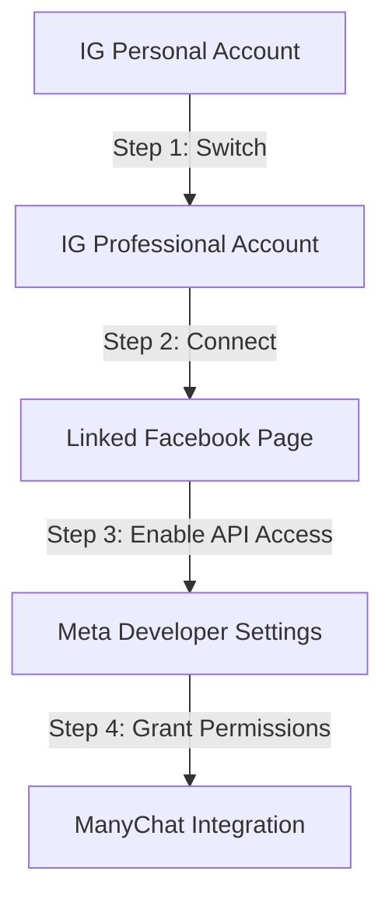
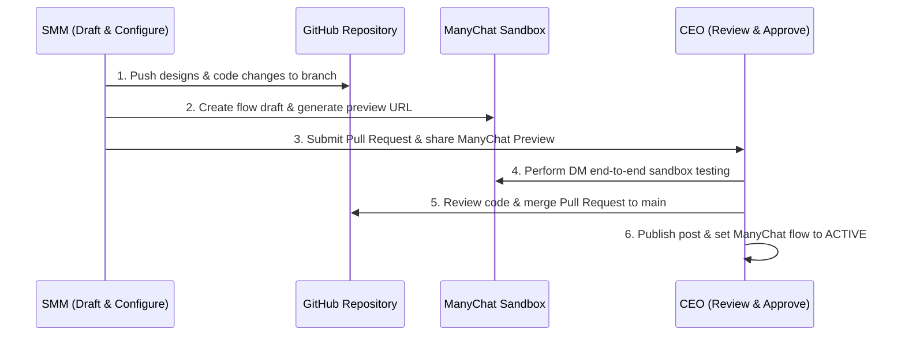

# 🗺️ Instagram Automation & Collaborative Control Roadmap
**Target Audience**: MetrixMedia Internal Leadership (CEO & SMM)  
**Objective**: Establish a secure, high-converting, automated lead acquisition funnel via Instagram DM triggers for the **Aegis Review Protocol**, governed by a robust SMM-to-CEO approval workflow.

---

## 📌 Executive Summary
To scale client acquisition for the **Aegis Protocol**, we are launching a conversational Instagram funnel. When local business prospects engage with our content (reels, posts, or stories) and DM specific keywords, ManyChat will instantly qualify them, generate a personalized live preview of their Aegis Review Portal, and sync their lead data to our database.

This roadmap details:
1. **Infrastructure**: Linking Instagram to Meta APIs and ManyChat.
2. **Technical Integration**: Directing ManyChat inputs into the `portal.html` dynamic parameters to generate real-time lead demos.
3. **Control Workflow**: The collaborative approval loop between the SMM and the CEO to ensure brand safety, design quality, and bug-free automation.

---

## 🛠️ Phase 1: Meta API & ManyChat Setup
To enable automated messaging, the `@MetrixMedia` Instagram account must be linked to Meta’s Business Manager and ManyChat. Follow these step-by-step instructions:



### Step 1: Instagram Account Optimization
1. Open the Instagram app on the agency phone, go to **Settings and Activity** -> **Account Type and Tools**.
2. Select **Switch to Professional Account** and choose **Business** (do not select *Creator*, as Business accounts have higher API rate limits).
3. Set the business category to **Digital Marketing Agency** and complete the profile details.

### Step 2: Link Facebook Page
1. Go to the Meta Business Manager Suite.
2. Under **Business Assets**, create or select the **MetrixMedia Facebook Page**.
3. Go to **Linked Accounts** -> **Instagram** and click **Connect Account**. Log in with the agency's Instagram credentials to establish a permanent bridge.

### Step 3: Enable Direct Message API Access (Crucial)
1. In the Instagram App, navigate to **Settings and Privacy** -> **Messages and Story Replies** -> **Message Controls**.
2. Scroll to the bottom and toggle **ON** the option for **Allow Access to Messages**.  
   *Note: If this is disabled, Meta's API will block ManyChat from intercepting incoming DMs.*

### Step 4: ManyChat Authentication
1. Log into the **ManyChat Portal** and click **Add New Channel** -> **Instagram**.
2. Authenticate using the CEO/Admin Facebook Account that owns the MetrixMedia Facebook Page.
3. Select the linked Instagram account and approve the permission requests. ManyChat will auto-verify the connection by querying the Meta Graph API.
4. Verify that the following permissions are green-lit:
   - `instagram_basic` (to read basic profile data)
   - `instagram_manage_messages` (to read and respond to DMs)
   - `pages_manage_metadata` (to handle incoming webhooks)

---

## 🔗 Phase 2: Aegis Review Portal Integration
The review portal (`portal.html`) dynamically adjusts its text, colors, icons, and redirect links using URL query parameters parsed by `portal.js`. We will utilize ManyChat to collect these variables from the prospect, construct a personalized URL, and send a live demo in the DMs.

### 1. Trigger Words Setup
We will establish three keyword triggers in ManyChat corresponding to the campaign niches outlined in the content plan:
* **Trigger 1**: `"AEGIS"` (General local businesses)
* **Trigger 2**: `"CAFE"` (Restaurants, Cafes, and Eateries)
* **Trigger 3**: `"CLINIC"` (Dental clinics, medical practices, salons, and spas)

These triggers will be case-insensitive and configured to fire when a user sends the standalone word or includes it in a sentence (e.g., *"Send me the cafe link"*).

### 2. Conversational Qualification Funnel
Once a trigger fires, ManyChat will guide the user through a quick 4-step conversation to gather setup parameters:

```text
[Trigger: "CAFE"] 
   └── ☕ "Hey there! Ready to stop 1-star coffee complaints from hurting your rating? Let's generate a live demo of your Aegis Portal right now. What is the official name of your Cafe?"
        └── (User inputs Business Name -> Saved to Custom User Field: {{business_name}})
             └── 📩 "Perfect. What is the business email where you want to receive private customer complaints?"
                  └── (User inputs Email -> Saved to Custom User Field: {{business_email}})
                       └── 🔗 "Got it! Paste your current Google Maps Review Link so we can route happy diners there:"
                            └── (User inputs URL -> Saved to Custom User Field: {{gmb_url}})
```

### 3. Dynamic Portal URL Construction
Using the variables saved in ManyChat, we will construct a custom link containing the query parameters parsed by `portal.js`. 

The variables correspond directly to the JS URL parameters:
* `name`: `{{business_name}}`
* `url`: `{{gmb_url}}` (URL-encoded)
* `email`: `{{business_email}}`
* `color`: Accent color matching their brand (e.g., `#00F2FE` for neon cyan or `#FFB300` for cafes). We can set this dynamically or default to our brand neon cyan.
* `category`: Determined by the trigger word (`cafe` for "CAFE", `dental` or `salon` for "CLINIC").
* `demo`: `true` (This forces a browser alert explaining GMB redirection to show the user how the system works without forcing them off the demo).

**Generated URL Template:**
```text
https://metrixmedia.agency/portal.html?name={{business_name}}&url={{gmb_url}}&email={{business_email}}&category={{category}}&color=%2300F2FE&demo=true
```

**Delivery Message in ManyChat:**
> ⚡ **"Your portal is ready! Tap below to open your customized, live review-gating demo. Try selecting 5 stars to see the Google redirect, or select 2 stars to see how we route complaints to your inbox."**  
> `[Button: Open Live Demo 🔗]` *(Links to the constructed URL)*

### 4. Lead Synchronization (CRM & Supabase Webhook)
To prevent leads from staying trapped in ManyChat, we will insert an **External Request** block at the end of the flow.
* **HTTP Method**: `POST`
* **Request URL**: `https://metrixmedia.agency/api/leads`
* **Headers**: `Content-Type: application/json`, `Authorization: Bearer {{api_key}}`
* **Payload Body**:
```json
{
  "name": "{{business_name}}",
  "email": "{{business_email}}",
  "phone": "{{user_phone_number}}",
  "gmb_link": "{{gmb_url}}",
  "source": "Instagram DM",
  "niche": "{{category}}",
  "created_at": "2026-06-15T17:21:33Z"
}
```
*Action: This triggers a database insert on Supabase, notifying the agency sales representative to follow up with the prospect.*

---

## 🤝 Phase 3: SMM & CEO Collaborative Workflow
To maintain high design aesthetics, bug-free scripts, and strict brand guidelines, a strict division of labor and verification loop is established between the SMM (Social Media Manager) and the CEO.



### Collaborative Workflow Breakdown

| Stage | Owner | Action Details | Deliverables / Tools |
| :--- | :--- | :--- | :--- |
| **1. Ideation & Assets** | SMM | • Drafts graphic designs (mockups/carousels) in the workspace directory under `social_media/`. <br>• Drafts post captions, hashtags, and specific keyword trigger lists. | `social_media/post1_mockup.png`<br>`social_media/instagram_launch_plan.md` |
| **2. Flow Drafting** | SMM | • Creates a new flow draft in ManyChat.<br>• Map user input fields to variables. Set up the dynamic URL builder button.<br>• Copy the ManyChat **Test Flow Link**. | ManyChat Flow Draft Link |
| **3. Code Adjustments** | SMM | • If the portal JS/HTML needs template modifications or styling tweaks, write updates to `portal.html` or `portal.js`.<br>• Push changes to git branch `feature/ig-automation` and open a Pull Request (PR). | GitHub Pull Request |
| **4. Technical Testing** | CEO | • Clicks SMM’s ManyChat test link to trigger the automation on the CEO's personal Instagram account.<br>• Verifies: Triggers work, dynamic URL builds properly, custom logo/branding loads, Swiggy/Google redirect behaves correctly, and lead data is written to database. | QA Checklist Signoff |
| **5. Design & Copy Review** | CEO | • Reviews copywriting, design templates, and overall aesthetics in the branch/PR.<br>• Requests adjustments on copywriting hooks, contrast adjustments, or formatting. | GitHub Code Review / Comments |
| **6. Deployment & Launch** | CEO | • Merges the PR to the `main` branch to push portal updates to production.<br>• Sets the ManyChat flow draft to **Active** (publishing it live).<br>• Publishes/schedules the post graphic and caption on Meta Business Suite. | Production Release |

---

## 📈 Phase 4: Launch & Monitoring Checklist
Before launching any content, run through this dry-run checklist to ensure absolute system stability:

- [ ] **Keyword Assertions**: Send `AEGIS`, `CAFE`, and `CLINIC` from a non-admin testing Instagram account. Ensure the correct niche flow triggers.
- [ ] **Special Characters Handling**: Input a business name with special characters (e.g. *Cut & Dye Salon*) to verify URL-encoding works properly.
- [ ] **Redirection Timer Verification**: Ensure the redirect overlay displays and counts down (3, 2, 1, redirect) before redirecting or prompting the user correctly.
- [ ] **Private Complaint Delivery**: Submit a 1-star rating in the portal, write feedback, and click submit. Verify that an email notification is successfully received at the parsed `email` parameter address.
- [ ] **Database Integrity**: Access the leads table/dashboard and confirm the record is written with correct timestamps, labels, and parameters.
- [ ] **Analytics Baseline**: Set up ManyChat Dashboard bookmarks to track:
  - *Trigger Conversion Rate* (Sends / Completes)
  - *CTR of Portal Demo Button* (Goal: > 45%)
  - *Lead-to-Client Conversion Rate* (Goal: 10% from DM demo to free trial sign-up)

---
> [!NOTE]
> All code changes, asset design modifications, and roadmap milestones are stored in the git repository at `c:\Users\sunny\.gemini\antigravity\scratch\MetrixMedia`. Pull requests must be submitted directly to the CEO for staging approvals.
